# Manual Technical Management (Dime.Scheduler)
Adds graphical planning capabilities based on Dime.Scheduler to Technical Management for service sales orders

## Dime.Scheduler Setup
This manual contains some basic setup regarding Dime.Scheduler that is directly related to the Technical Management (Dime.Scheduler). The product contains several possibilities to integrate with other platforms and also with other functional areas inside Business Central. The product documentation of the product can be found at [docs.dimescheduler.com](https://docs.dimescheduler.com)

### Creating an API key in Dime Scheduler
In the supplied Dime.Scheduler wizard go to Administration -> API keys:

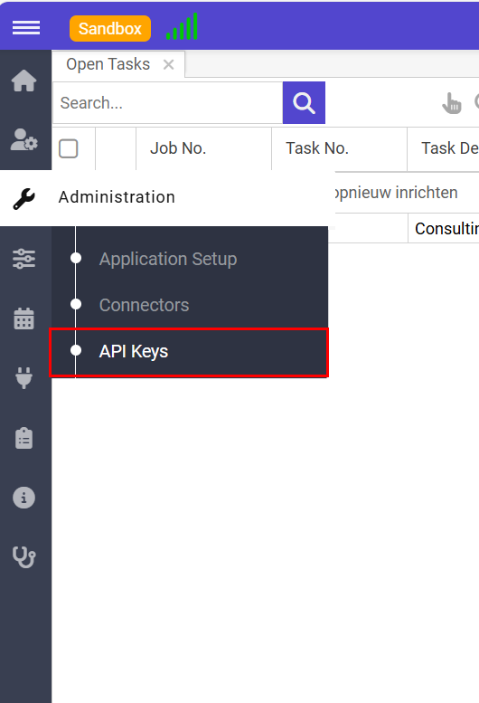

Add a new API key with a description and duration:

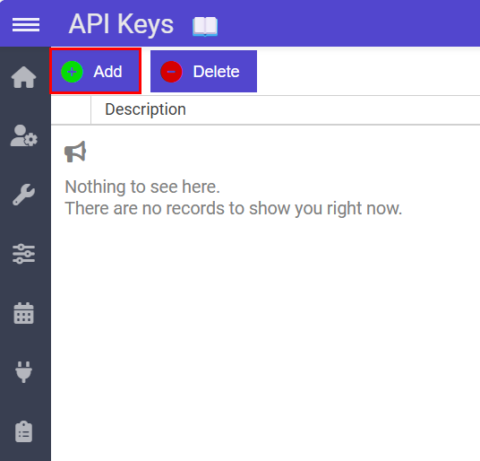

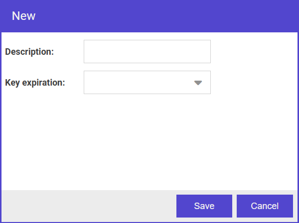

After clicking Save, the system will show the complete API key once. So please store it in a save location. The value will be masked by asteriskes:

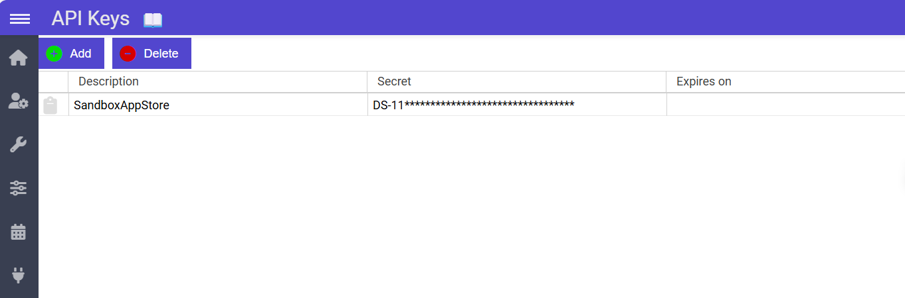

### FastTrack Wizard
The easiest way to start using Dime.Scheduler with Business Central is using the Fast Track Setup from within Business Central. 

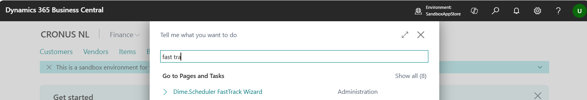

On the first page, the following values must be entered:

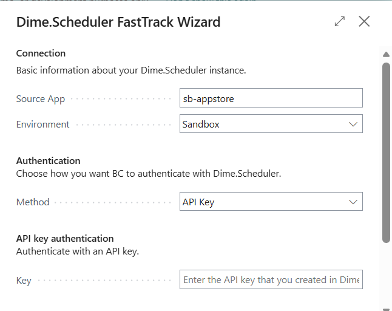

* Source App: All planning information that is sent to Dime.Scheduler will include this Source App value. The Source App values links the data in Dime.Scheduler to a specific Connector (which means back office system). In this case Business Central.
* Environment: The relevant options are Sandbox and Production. This refers to the instance of Dime.Scheduler that must be linked. The option On-Prem is also available for legacy support. New customers will however always be cloud customers.
* Authentication: Defines how the authentication from Business Central to Dime.Scheduler will take place. This can be based on Username & Password, which refers to a Forms user in Dime.Scheduler. The preferred option is to use the API Key. 

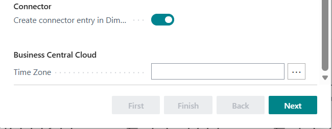

* Connector, Create connector entry in Dime.Scheduler: This creates the basic connector entry, without authentication details for communicating back to Business Central, in Dime.Scheduler. By enabling this, the step of manually adding the web service address in Dime.Scheduler is not necessary.
* Business Central Cloud, Time Zone: It's not necessary to supply a value. Technical Management (Dime.Scheduler) will handle time zone issues based on a Technical Management setting.

After clicking Next, the supported functional areas can be enabled/disabled.
To synchronize resources, make sure to select Enable Resource Planning.

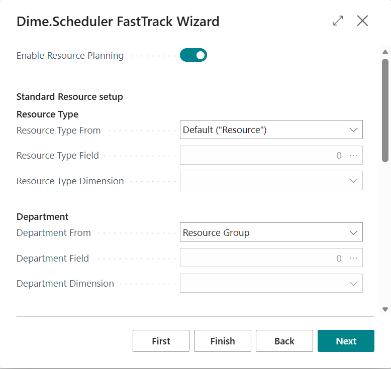

On one of the later steps, make sure that Enable Sales Planning Lines is enabled.
This enables the functionality of planning Sales Plan. Lines for services.

Once the wizard is finished, make sure to synchronize the data to Dime.Scheduler.

### Connector Setup
After the FastTrack wizard has been completed, setup of the connection details to Dime.Scheduler can be found and edited from the Dime.Scheduler Connector Setup.

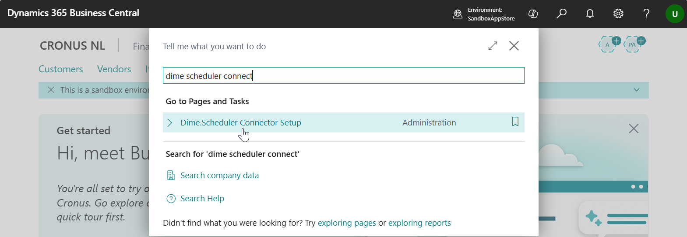

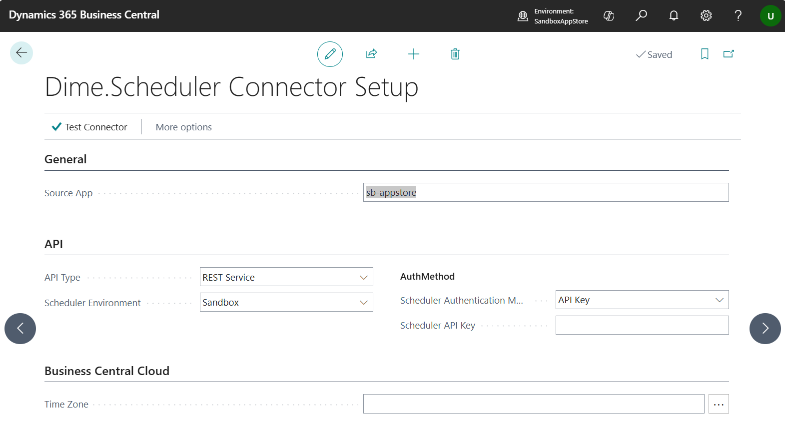

> [!IMPORTANT]
Dime.Scheduler uses the value of Source App to determine which data belongs to which connector. Please don't change the value of Source App once data is synchronized with Dime.Scheduler.

### General Setup
After the FastTrack wizard has been completed, setup of the functional areas can be found and edit from the Dime.Scheduler Setup

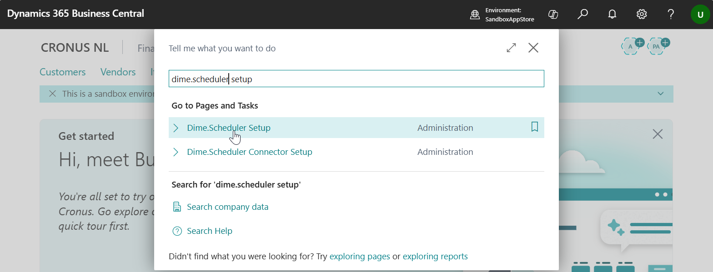

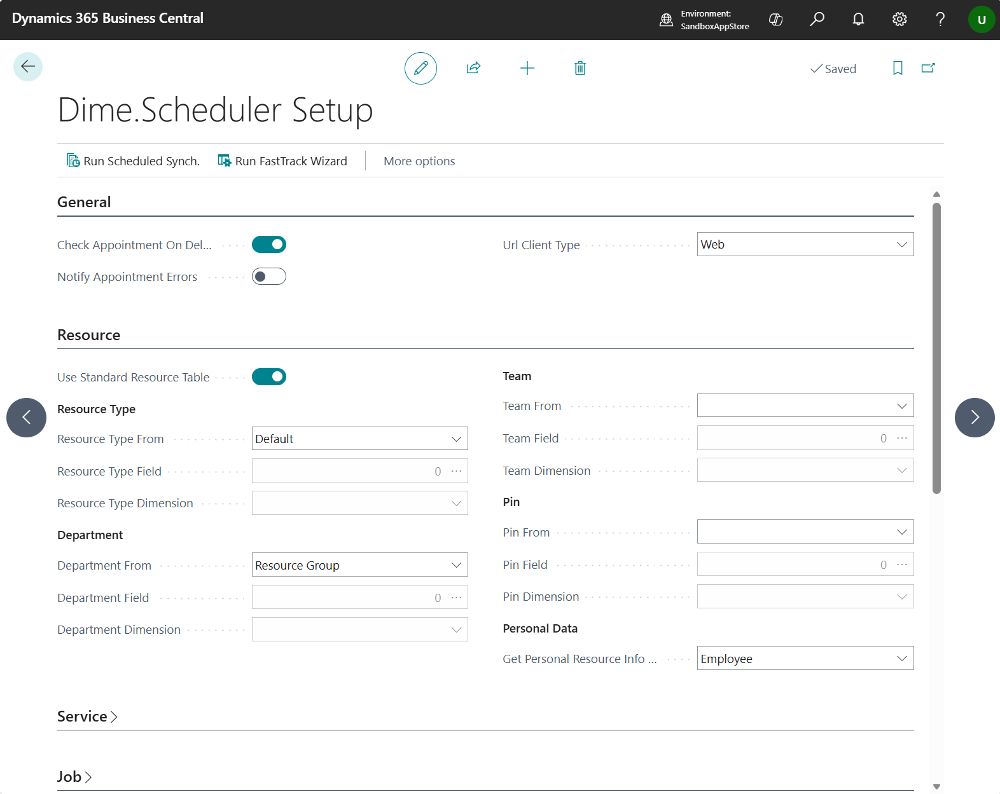

### Source Types
To be able to process planning requests from Dime.Scheduler related to Sales Plan. Lines, go to Dime.Scheduler Source Types and create a record with the following details.

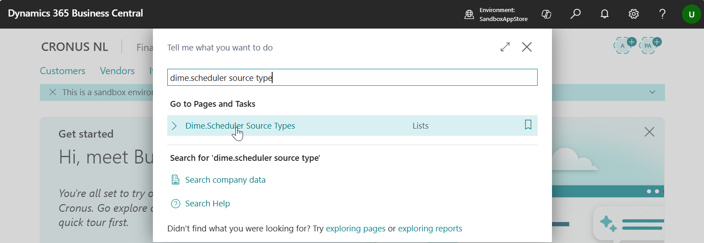

* Source Table No.: 72803636
* Table Name: Sales Plan. Line CBLC
* Source Type: SLSPLANLN
* Processing Codeunit No.: 72804089
* Processing Codeunit Name: DS Handle Sales Plan. DPZS

### Filter Groups and Filter Values
In Dime.Scheduler, appointments can be marked with different colors based on Filter Groups. The color of the complete appointment can set up with a FilterGroup with Type=Category. The color of the horizontal marker in the appointment can be set up by using a FilterGroup with Type=TimeMarker.

Another use for Filter Groups is using them in Doc. Filter Value Sources, and add extra information to the values that are already sent to Dime.Scheduler. 

For the Technical Management (Dime.Scheduler) solution, the following FilterGroups must be added.

| Type                  | Group Name              | 
| --------------------- | ----------------------- | 
| FilterGroup           | Resource Groups         | 
| FilterGroup           | Skills                  | 
| Category              | Item Category           | 
| TimeMarker            | Status                  | 

To do that, find Dime.Scheduler Filter Groups and add the mentioned new records.

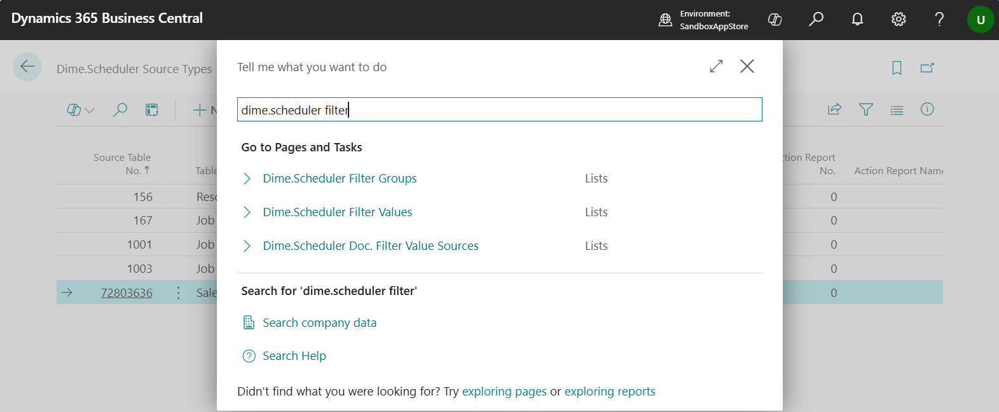

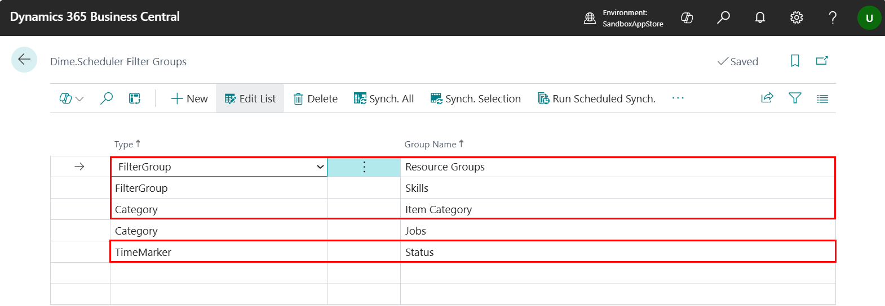

Per filter group, additional setup is necessary, that will be explained in the following steps.
After all filter group setup is available in the system, make sure to synchronize the data to Dime.Scheduler:

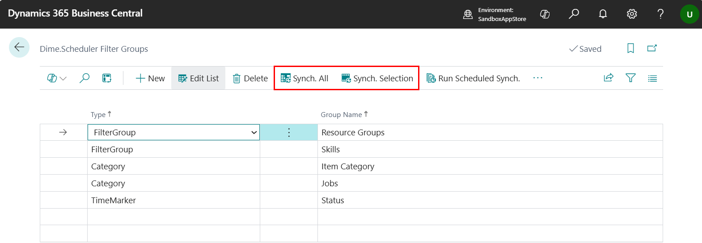

##### Resource Groups
Select the created filter group for Resource Groups and use the action Related -> Sources.

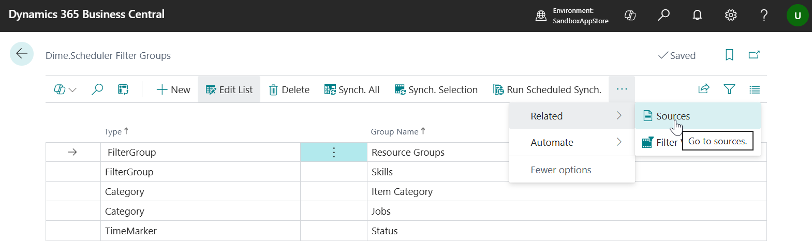

Add the following record:

* Type: FilterGroup
* Group Name: Resource Groups
* Table No.: 152
* Field No.: 1

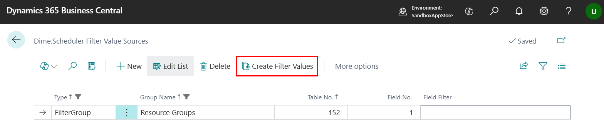

To create the filter values, make sure to use the action Create Filter Values.

##### Skills
Select the created filter group for Skills and use the action Related -> Sources.

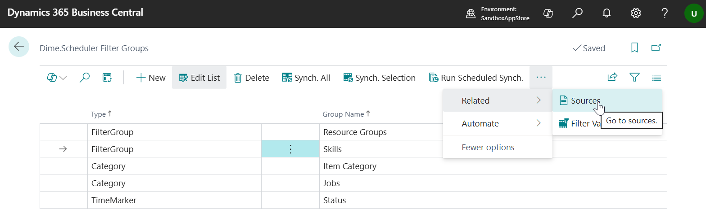

Add the following record:

* Type: FilterGroup
* Group Name: Skills
* Table No.: 5955
* Field No.: 1

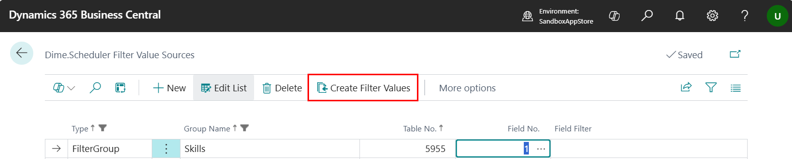

To create the filter values, make sure to use the action Create Filter Values.

##### Item Category
Select the created filter group for Item Category and use the action Related -> Sources.

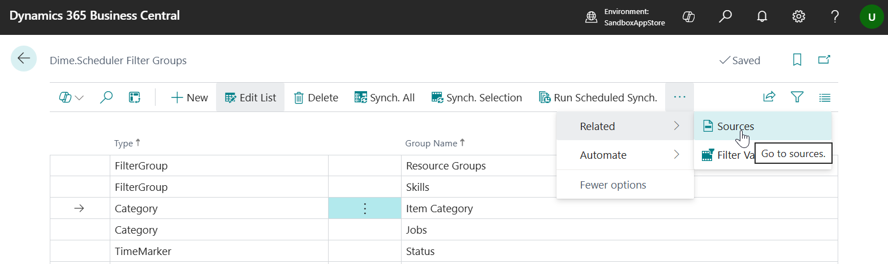

Add the following record:

* Type: Category
* Group Name: Item Category
* Table No.: 5722
* Field No.: 1

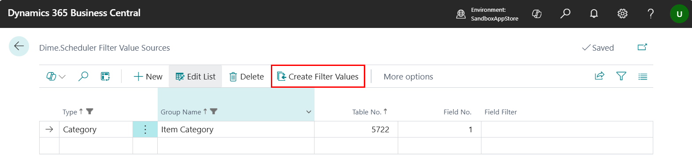

To create the filter values, make sure to use the action Create Filter Values.
On the filter values (action Related -> Values) it's possible to assign the colors per Item Category.

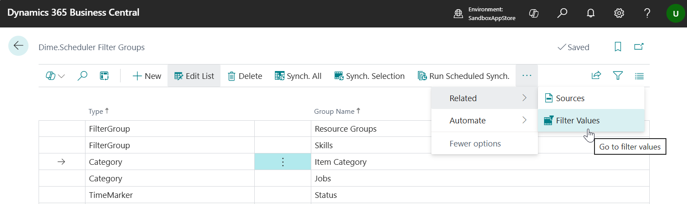

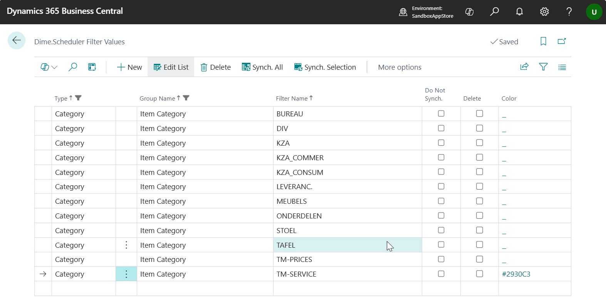

Clicking on the value Color opens a color picker, that enables you enter or select an html color code.

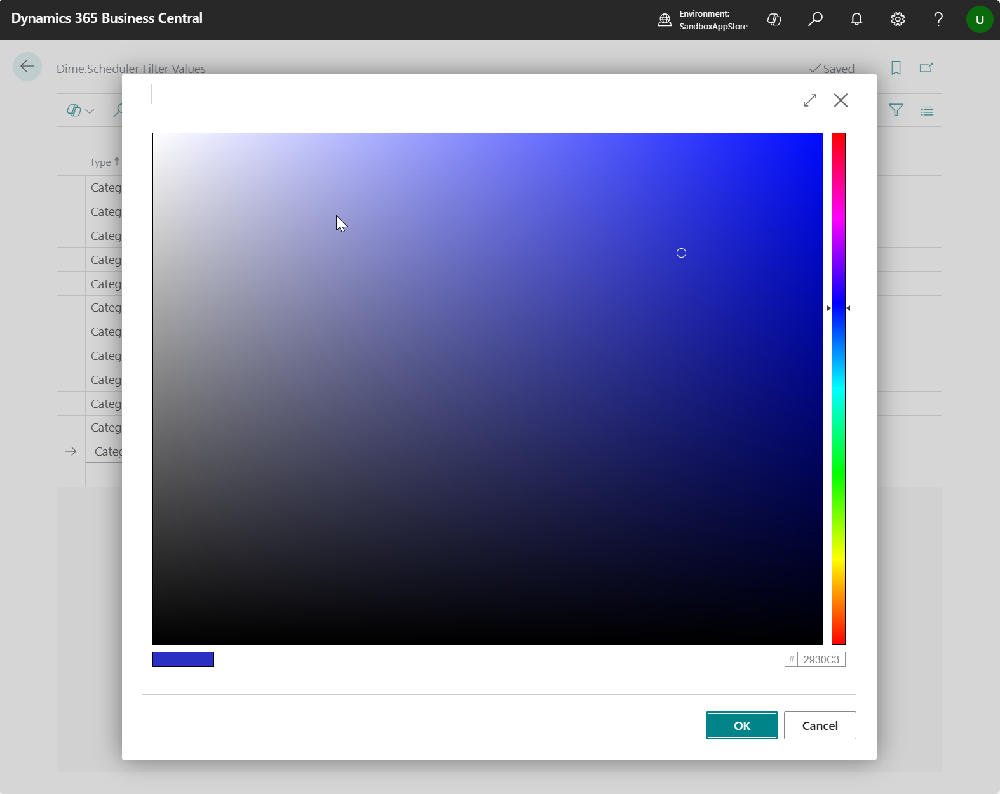

##### Status
Select the created filter group for Status and use the action Related -> Values.

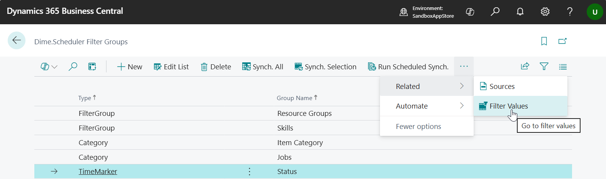

Add the following records:
Record 1:
* Type: TimeMarker
* GroupName: Status
* Filter Name: IN PROGRESS
* Color: #FB9539

Record 2:
* Type: TimeMarker
* GroupName: Status
* Filter Name: NEW
* Color: #A71266

Record 3:
* Type: TimeMarker
* GroupName: Status
* Filter Name: ON THE WAY
* Color: #C5C735

Record 4:
* Type: TimeMarker
* GroupName: Status
* Filter Name: PLANNED
* Color: #1688DA

Record 5:
* Type: TimeMarker
* GroupName: Status
* Filter Name: READY
* Color: #32CCCC

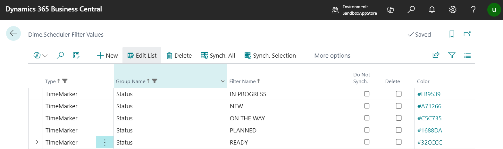

### Doc. Filter Value Sources
In Technical Management (Dime.Scheduler) the Doc. Filter Value Sources are used to be able to filter resources for a task based on resource group and skills. 

 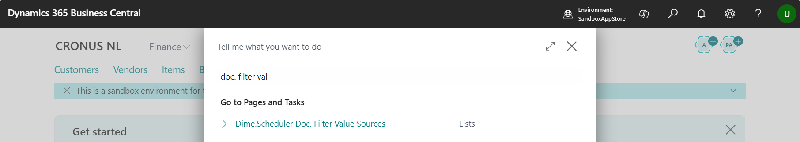

In the following situation, the Doc. Filter Value Sources for tables 156 (Resource), 1001 (Job Task) and 1003 (Job Planning Line) already existed, based on the data created by the FastTrack Setup

Add the following record:

* Table No.: 72803636
* Table Name: Sales Plan. Line CBLC
* Entity Type: Task
* Job Key Field No.: 72804079
* Job Key Field Name: Combined Project No.
* Task Key Field No.: 4
* Task Key Field Name: Resource Group No.

 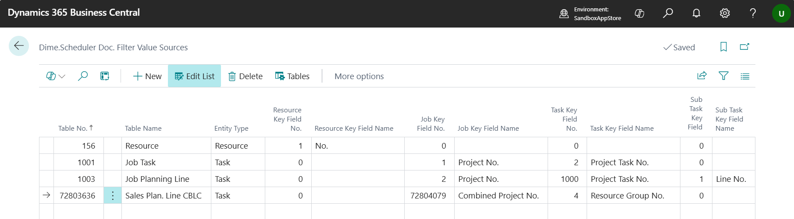

In the following steps we will furter set up the doc. filter value sources for the tables 156 (Resource) and 72803636 (Sales Plan. Line CBLC).

#### Resource
Select the record with Table No. 156 and Table Name Resource and use the action Tables.

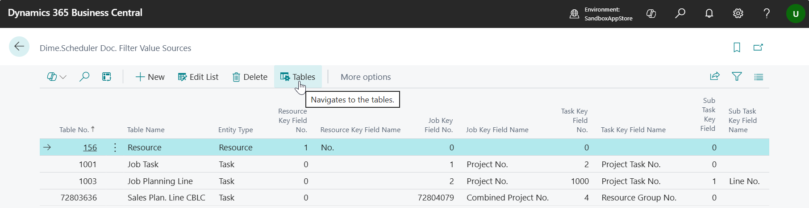

By default, only a record linked to table 156 is available, without any further fields, links, filters and conditions. 

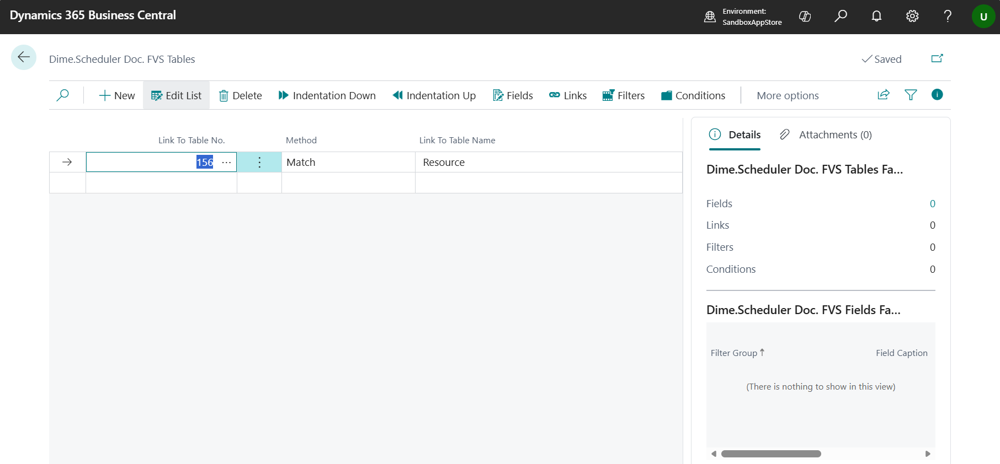

Add the following records and make sure that those records have been indented one level down with the action Indentation Down

Record 1 (Resource Group):
* Link to Table No.: 152
* Method: All
* Link To Table Name: Resource Group

Record 2 (Resource Skill): 
* Link to Table No.: 5956
* Method: All
* Link To Table Name: Resource Skill

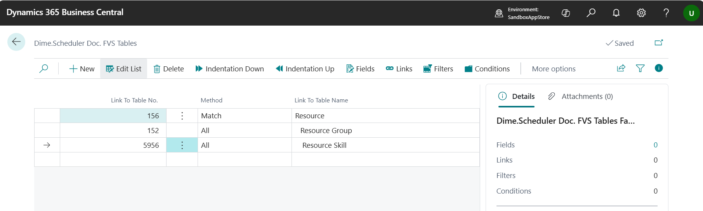

Add the following detail records for table 152 (Resource Group)

**Fields**

* Filter Group: Resource Groups
* Field No.: 1
* Fixed Value Behavior: Overrule When Empty
* Fixed Value When Not Found: Empty
* Hierarchy Behavior: None

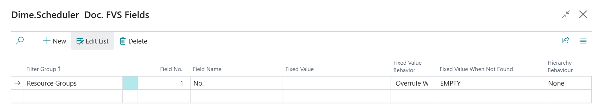

**Links**

* Link From Field No.: 14
* Link From Field Name: Resource Group No.
* Link To Field No.: 1
* Link To Field Name: No.

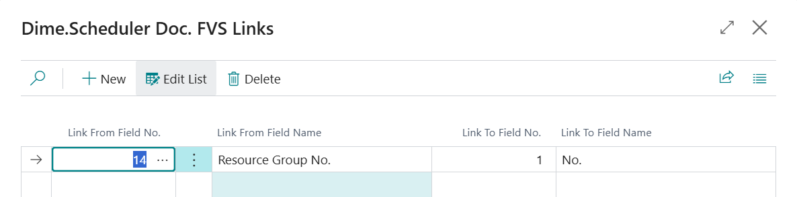

Add the following detail records for table 5956 (Resource Skill)

**Fields**

* Filter Group: Skills
* Field No.: 3
* Field Name: Skill Code
* Fixed Value Behavior: None
* Fixed Value When Not Found: EMPTY
* Hierarchy Behavior: None

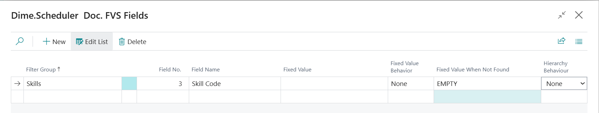

**Links**

* Link From Field No.: 1
* Link From Field Name: No.
* Link To Field No.: 2
* Link To Field Name: No.

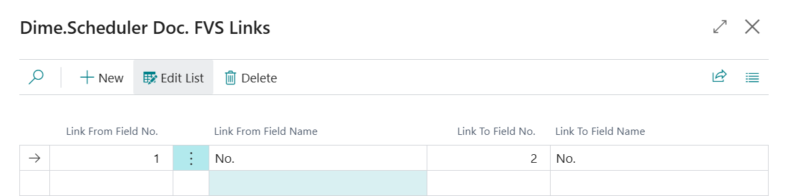

**Filters**

Link To Field No.: 1
Link To Field Name: Type
Value: Resource

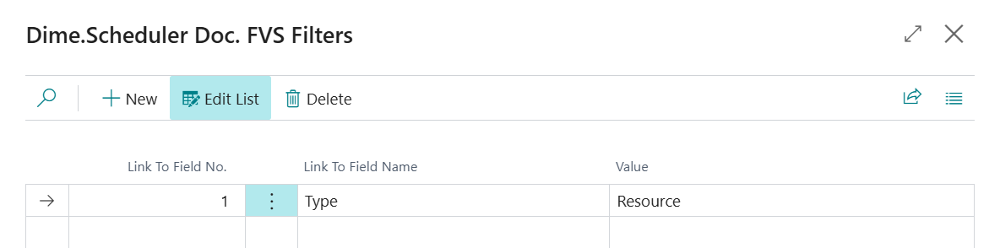

#### Sales Plan. Line CBLC
On the Doc. Filter Value Sources, select the record for table 72803636 and use the action to go to the related tables.

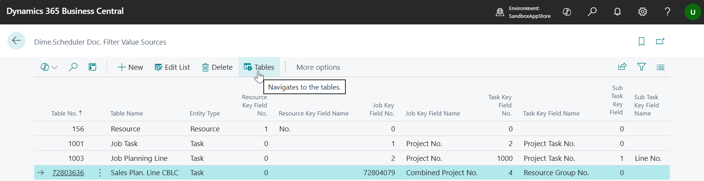

By default the record for table 72803636 (Sales Planning Line) with Method Match exists.
Add the following records and make sure that those records have been indented one level down with the action Indentation Down

Record 1 (Resource Group)
* Link to Table No.: 152
* Method: Match
* Link To Table Name: Resource Group
* Indent Down: 1 time

Record 2 (Sales Line)
* Link to Table No.: 37
* Method: Match
* Link To Table Name: Sales Line
* Indent Down: 1 time

Record 3 (Skill Line)
* Link to Table No.: 72803581
* Method: All
* Link To Table Name: Skill Line
* Indent Down: 2 times

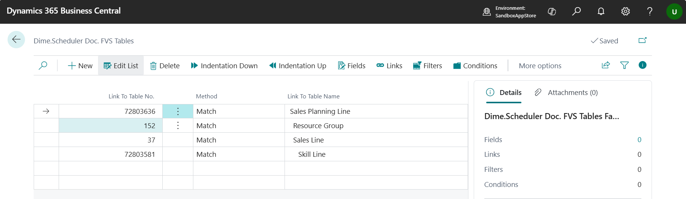

Add the following detail records for table 156 (Resource Group)

**Fields**

* Filter Group: Resource Groups
* Field No.: 1
* Fixed Value Behavior: Overrule When Empty
* Fixed Value When Not Found: EMPTY
* Hierarchy Behavior: None

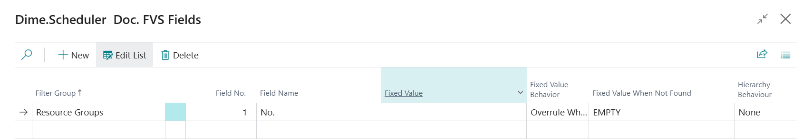

**Links**

* Link From Field No.: 4
* Link From Field Name: Resource Group No.
* Link To Field No.: 1
* Link To Field Name: No.

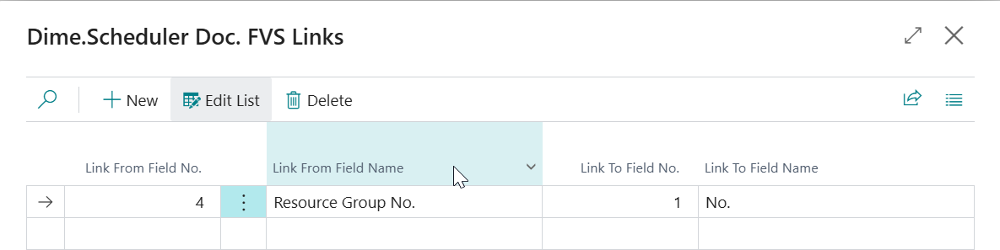

Add the following detail records for table 37 (Sales Line)

**Links**

Record 1 (Document Type)
* Link From Field No.: 1
* Link From Field Name: Document Type
* Link To Field No.: 1
* Link To Field Name: Document Type

Record 2 (Document No.)
* Link From Field No.: 2
* Link From Field Name: Document No.
* Link To Field No.: 3
* Link To Field Name: Document No.

Record 3 (Line No.)
* Link From Field No.: 3
* Link From Field Name: Document Line No.
* Link To Field No.: 4
* Link To Field Name: Line No.

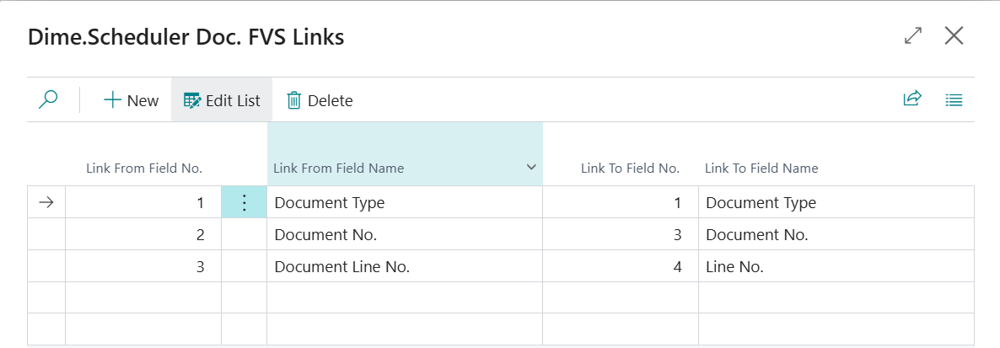

Add the following detail records for table 72803581 (Skill Line)

**Fields**

* Filter Group: Skills
* Field No.: 3
* Field Name: Skill Code
* Fixed Value Behavior: None
* Hierarchy Behaviour: None

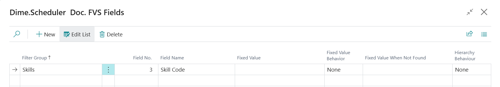

**Links**

* Link From Field No.: 2000000000
* Link From Field Name: System ID
* Link To Field No.: 2
* Link To Field Name: Source System ID

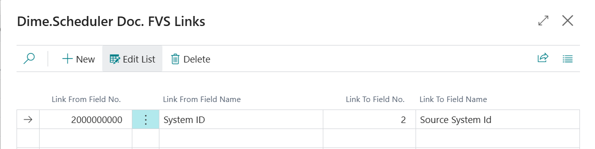

**Filters**

* Link To Field No. 1
* Link To Field Name: Table Id
* Value: 37

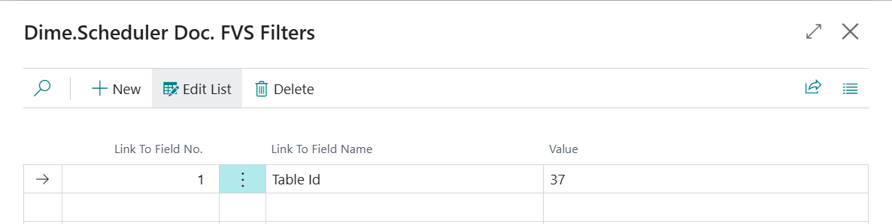

### Schedule Synchronization with the Job Queue
Job Queue Entries in Business Central can be used to schedule recurring actions.

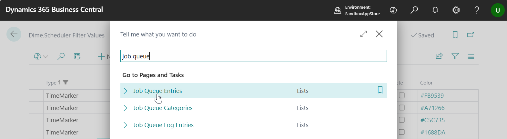
 
To make sure that newly added resources and newly added filter values are synchronized periodically,  a new Job Queue Entry record can be added for codeunit 2087634 (Dime DS Scheduled Synch.).

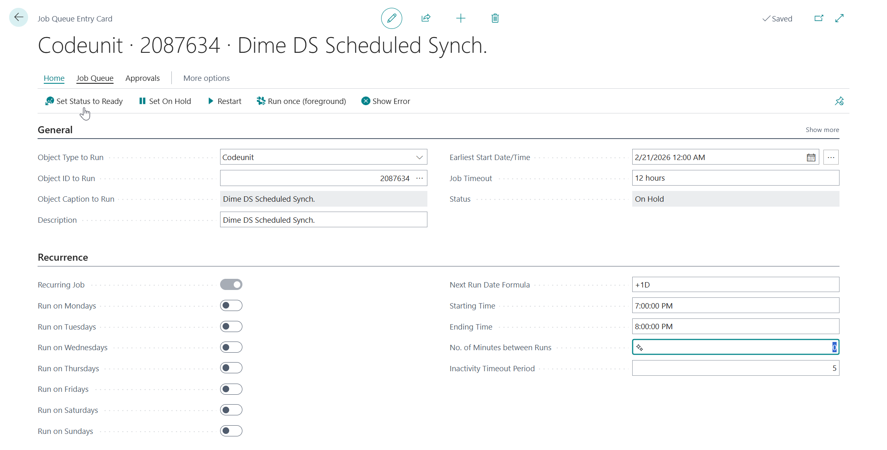

After creating the entry, make sure to use the action Set Status to Ready.

> [!IMPORTANT]
>The user that creates this Job Queue Entry must be assigned all necessary permissions to perform the synchronization in Business Central.

### Localization
In Dime.Scheduler some custom fields on Job Task level are used to store Technical Management specific information. Those can be added to profiles to make this information available for the user. It's however convinient that the fields have a corresponding name in both Business Central and Dime.Scheduler. This can be done by navigating to Setup -> Localization in Dime.Scheduler.

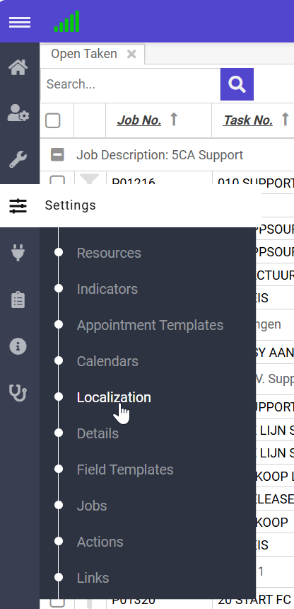

The following custom fields are used:

| Context        | Field Name           | Source Table   | Description               | Format   |
|----------------|----------------------|----------------|---------------------------|----------|
| DATABASEFIELD  | FreeText1            | Task           | Object No.                |          |
| DATABASEFIELD  | FreeText2            | Task           | Object Description        |          |
| DATABASEFIELD  | FreeText3            | Task           | Time Window Code          |          |
| DATABASEFIELD  | FreeDate1            | Task           | Time Window Starting Time | H:i      |
| DATABASEFIELD  | FreeDate2            | Task           | Time Window Ending Time   | H:i      |
| DATABASEFIELD  | FreeDate3            | Task           | Min. Starting Date Time   |          |
| DATABASEFIELD  | FreeDate3            | Task           | Max. Starting Date Time   |          |
| DATABASEFIELD  | FreeBit1             | Task           | Blocked for Planning      |          |
| DATABASEFIELD  | FreeBit2             | Task           | Enabled for Time Sheets   |          |

[:arrow_left:](../README.md) [Back](../README.md)