# Manual Technical Management (Dime.Scheduler)
Adds graphical planning capabilities based on Dime.Scheduler to Technical Management for service sales orders

## Prerequisites
To be able to use the Technical Management (Dime.Scheduler) app, the following prerequisites apply:
* An instance of Dime.Scheduler must be available. 
* The app Technical Management (Dime.Scheduler) is dependent on the Bluace apps Base Functionality and Technical Management. There is also a dependency on the Dime.Scheduler app by Dime Software. All mentioned apps will automatically be installed once Technical Management (Dime.Scheduler) is installed.
* At least the apps Technical Management and Technical Management (Dime.Scheduler) must be activated in the Bluace Products page.
* To be able to use the service sales planning capabilities of Technical Management, the service module must be enabled in Technical Management.
* Users must be assigned permission sets to use the Technical Management (Dime.Scheduler) functionality.

The mentioned prerequisites are described below in more detail.

### Dime Scheduler instance
[Dime.Scheduler](https://www.dimescheduler.com/) is a planning tool that is made available as a cloud product by Dime Software. Please [contact us](https://support.bluace.nl/) to obtain an instance to use with Technical Management (Dime.Scheduler).

### Activating Bluace products
Once Technical Management (Dime.Scheduler) is installed from Microsoft AppSource by a Business Central SUPER user, go to the page Bluace Products in Business Central.

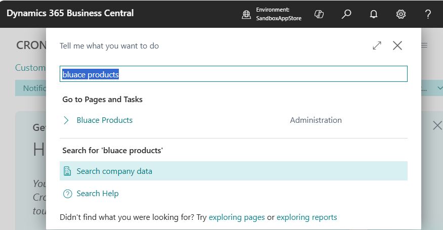

Activate at least the apps Technical Management and Technical Management (Dime.Scheduler).

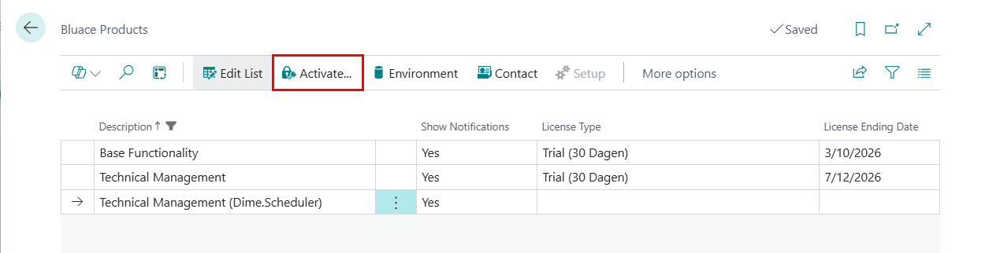

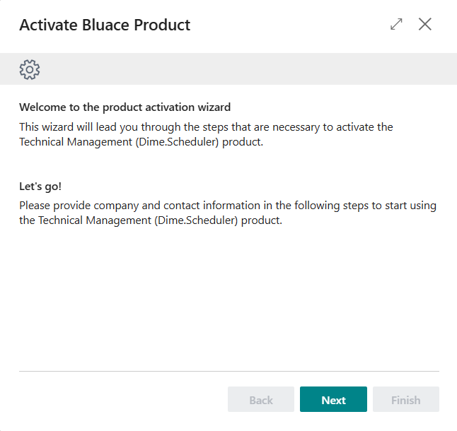

Please supply the company information in the second step.

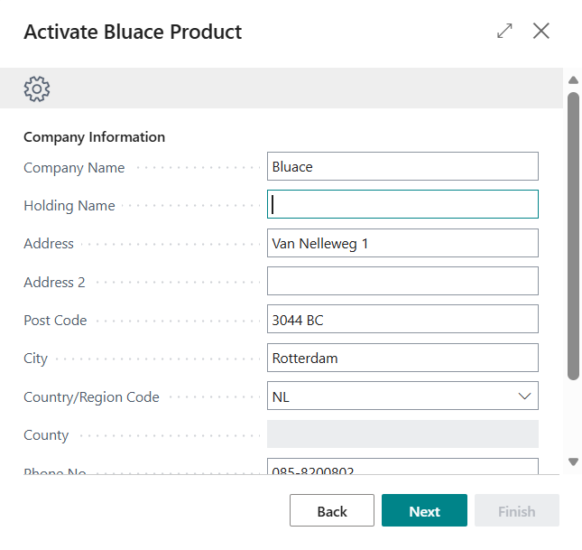

Please supply the contact information in the third step. This person will also be contacted and e-mailed about the license.

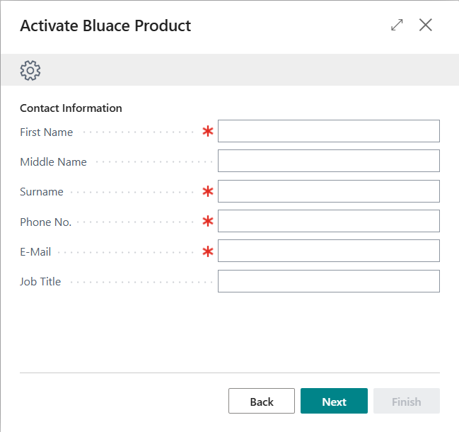

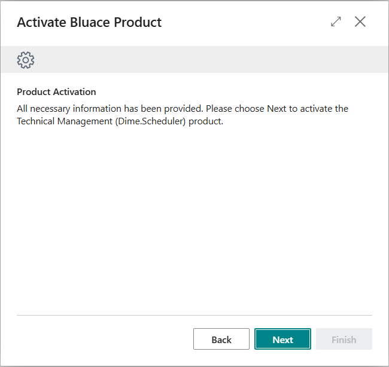

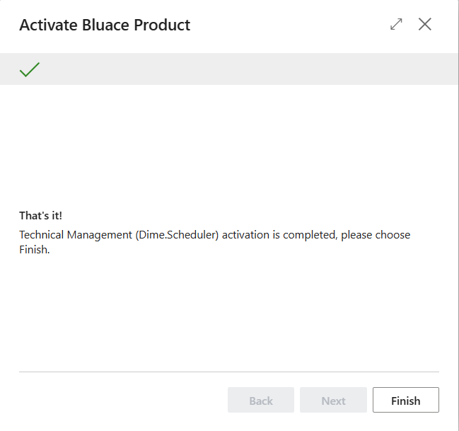

### Enabling the service module of Technical Management
Use the notification on the Role Center to enable the service module of Technical Management:

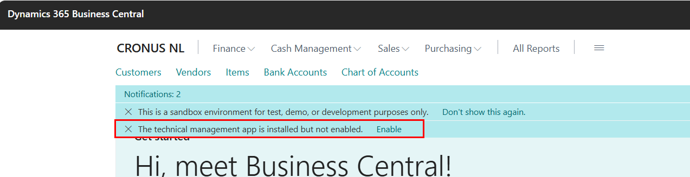

It's also possible to open the wizard through Assisted Setup:

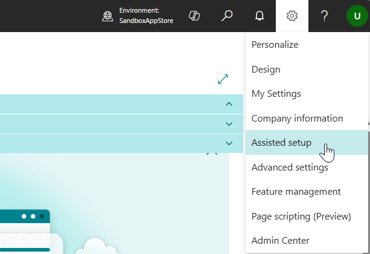

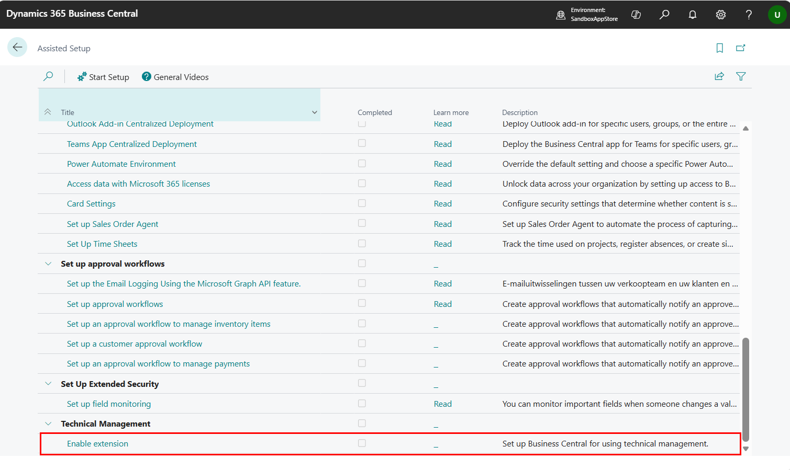

Make sure to enable Technical Management and the service module:

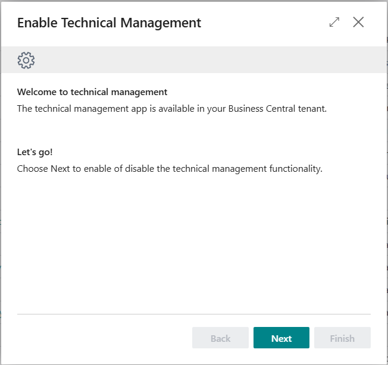

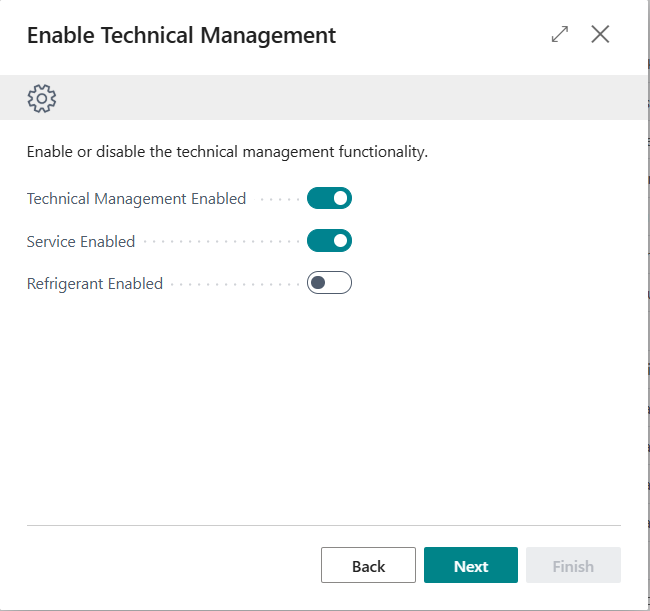

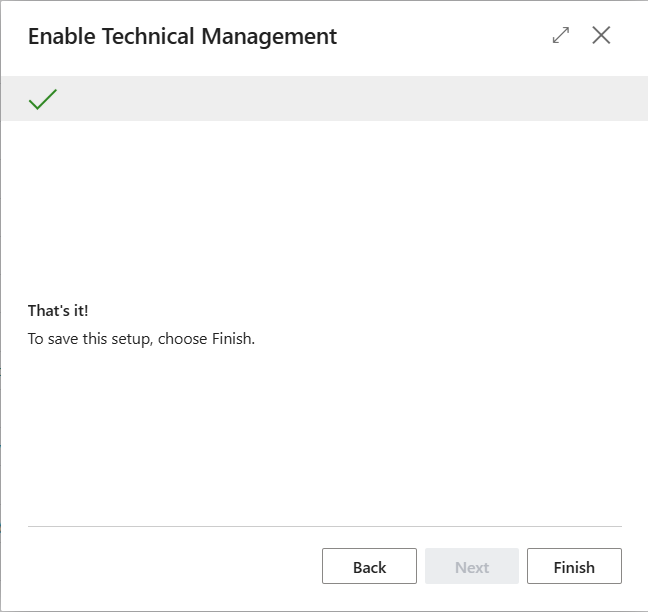

### Assigning permission sets
Please make sure that the following permission sets are assigned to the users that will use the Technical Management (Dime.Scheduler) functionality. It's also possible to create derived permission sets, to assign sub sets of permissions to groups of users. To make sure that future developments don't break those permission sets, please exclude permissions based on the permission sets below.

* TECH. MGT. CBLC
* TECH. MGT. DIME DBLC
* DIME DS ADMIN

To make sure that license checks will be performed correctly, all users must have the following permission set assigned:

* LICENSING USER LBLC

The user that is in charge of licensing the products must have the following permission set assigned.

* LICENSING ADMIN LBLC

[:arrow_left:](../README.md) [Back](../README.md)