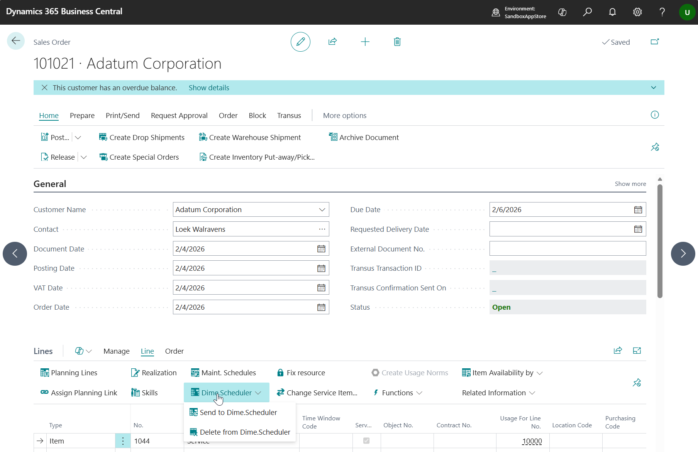
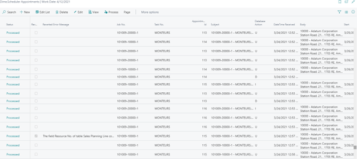
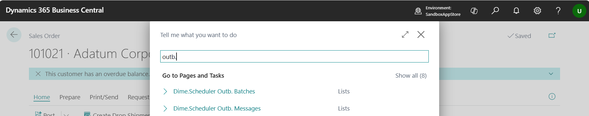

# Manual Technical Management (Dime.Scheduler)
Adds graphical planning capabilities based on Dime.Scheduler to Technical Management for service sales orders

## Service Order Processing
When a Sales Order with a Sales Plan. Line is created, the Sales Plan. Line will be available as Open Task in Dime.Scheduler. It can be planned to all resources that are linked to a corresponding Resource Group with a corresponding Skills.

Once the order processing reaches the moment that the Sales Plan. Line status is On The Way, it's not possible anymore to change the planning. When the order is realized, the starting and ending date time will be updated according to the realization.

### Manually trigger communication
When a Sales Plan. Line must be created as Job Task or Appointment in Dime.Scheduler, then the corresponding Sales Line will also be sent as Job. This happens automatically when a Sales Line and Sales Plan. Line are created/modified.

In case a correction must take place, it's possible to manually trigger a sales line to be sent to Dime.Scheduler or removed from Dime.Scheduler.

### Logging
Appointments that are planned are logged in Business Central in the Dime.Scheduler Appointments.
When inbound processing of a sales planning runs into an error, the field Reverted will be enabled and the Reverted Error Message is filled with the original error text. The original appointment information is sent back to Dime.Scheduler, which reverts the action in Dime.Scheduler.

Outbound communication takes place in batches. Batches contain 1 or multiple messages. Those can be opened and reviewed from within Business Central.

When sending a message runs into an error, the error is stored on the outbound message table. It's also possible to resend a specific outbound message from this page.

> [!IMPORTANT]
>Make sure that only the last message for an order is reprocessed. Reprocessing of messages can solve but also cause inconsistencies between the planning in Business Central and Dime.Scheduler.

[:arrow_left:](../README.md) [Back](../README.md)