# Manual Technical Management (Dime.Scheduler)
Adds graphical planning capabilities based on Dime.Scheduler to Technical Management for service sales orders

## Technical Management Setup
Some basic setup in Business Central and Technical Management specifically is necessary to make the integration with Dime.Scheduler work.

### Object Setup
On the Object Setup, make sure that the Time Zone is set up with the time zone that is used in the current company. This makes sure that UTC times are recalculated correctly by the system when received through the web service. Please set the fields Time Zone Conversion Type and Default Web Service Time Zone.

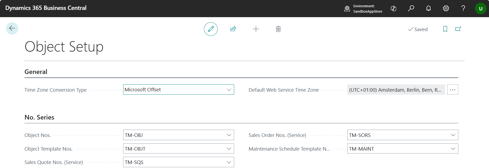

### Contract Setup
The integration with Dime.Scheduler for Sales Order Lines only works for Sales Lines with the field Service enabled. Only items in specific item categories will have this field enabled. 

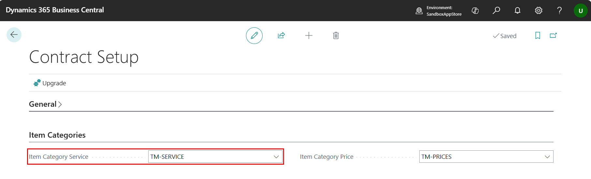

The field Item Category Service in the Contract Setup defines that item category.
All items with Type=Service that are part of this item category or one item category below in hierarchy will be considered to be a Service.

### Human Resources Setup

Make sure that the base unit of measure for human resources is in minutes.

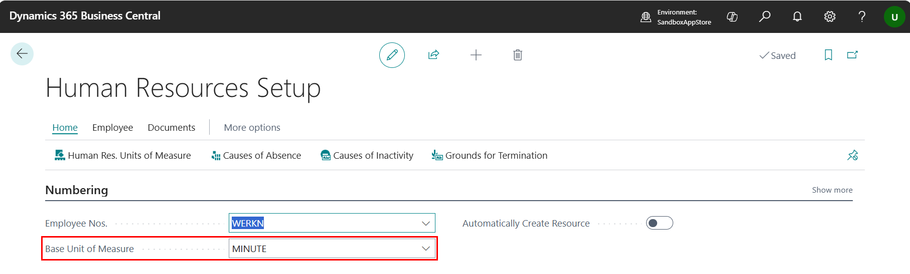

Also add the unit of measures for hour and day to the human resources units of measure, with the correct Qty. per Unit of Measure.

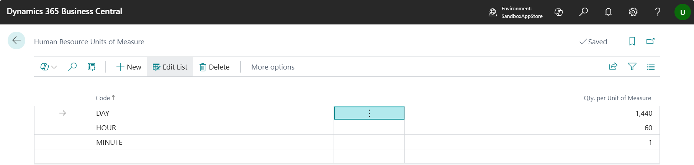

### Resource Groups

In the integration with Dime.Scheduler, the planning is based on Resource Groups. 
When a Sales Order Line is added that needs to be planned, the requested resource capacity is added to that line for a specific Resource Group. Only resources with a link to that Resource Group can fulfill that planning.

Only leave the field Primary empty for resource groups that are planned on parallel with a primary resource.

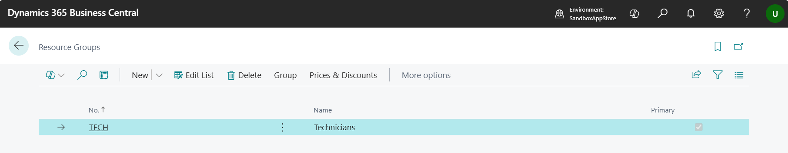

> [!IMPORTANT]
>It's not possible to link resources to multiple resource groups. When resources fulfill multiple types of tasks, an alternative can be to use skills for that purpose.

### Resources
On resources the Resource Group No. must be filled.

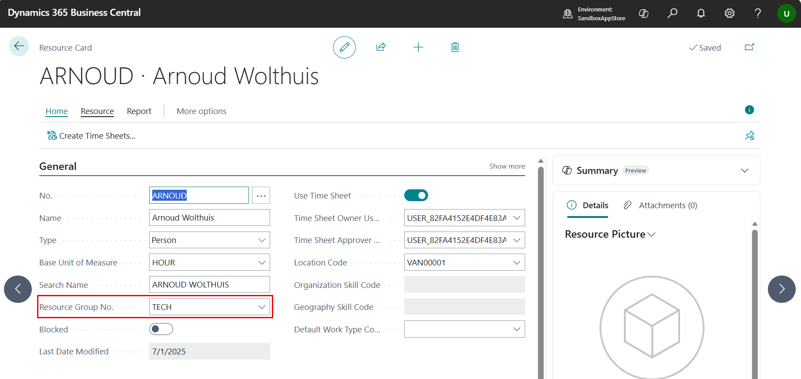

Also set up the skills for the resource. It's only possible to plan resources to items later on with a matching skill set.

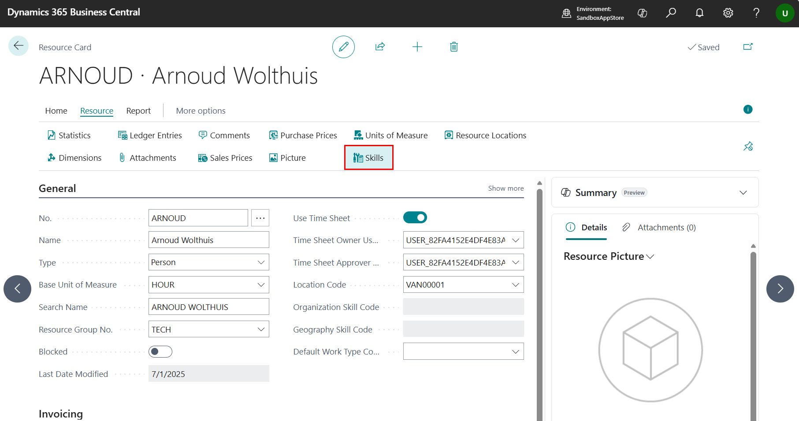

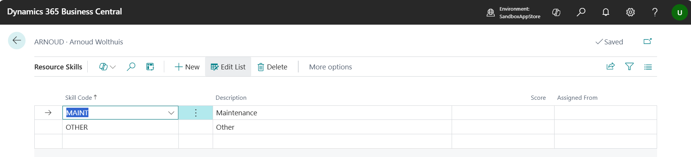

### Items
The color of the appointment block in Dime.Scheduler is defined by the Item Category Code, besides the fact that it determines whether the item is considered to be Service. So, it's important that it's filled with the value that is set up in the Contract Setup or one level in hierarchy below.

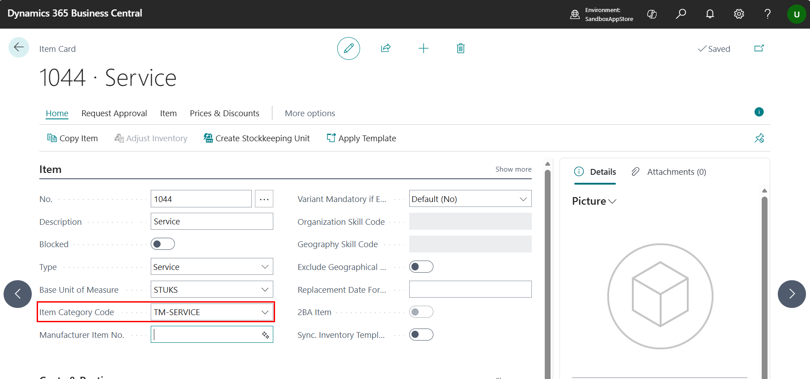

How much time is requested to be planned for a service can be set up with the action Related -> Planning Norms.

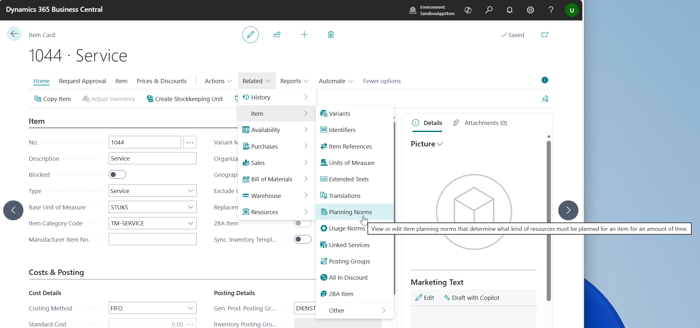

Here we can determine the default planning for this item for a resource in a specific resource group.
In this case, the define that when this item must be planned, 0.5h is requested for a technician.

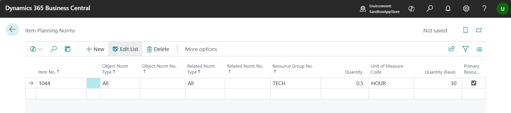

Also there is a possibility to link specific skills to an item. By doing that, the system will only allow resources with matching skills to be planned.

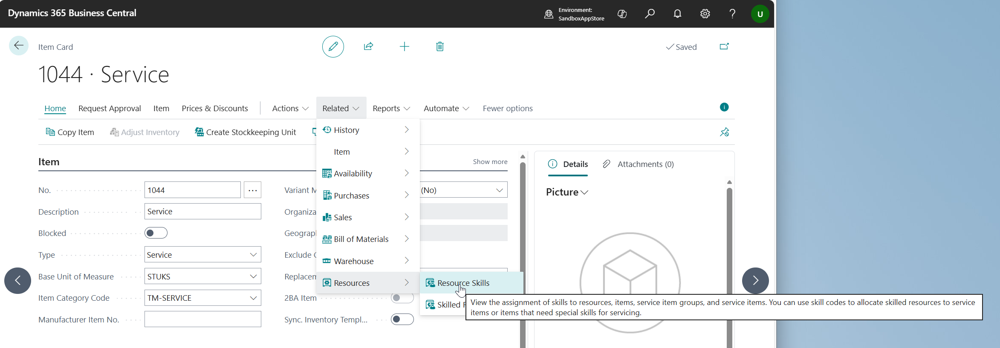

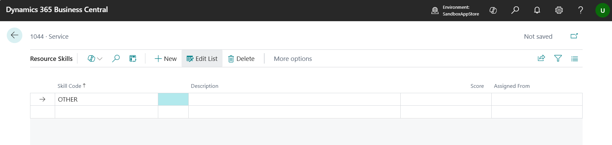

[:arrow_left:](../README.md) [Back](../README.md)